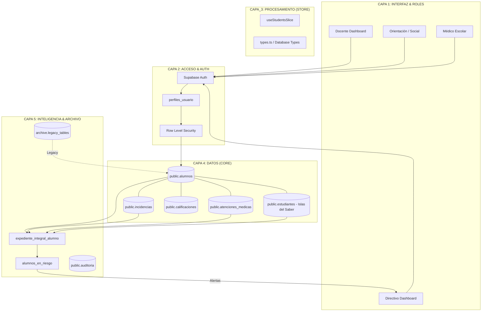

# Arquitectura Integral SASE-310 & Islas del Saber

## Diagrama de Capas

---

## Estado de la Integración

### 1. Higiene de Datos

- **Acción**: Se creó una migración SQL para mover tablas `students`, `incidents` y sandboxes al esquema `archive`.
- **Resultado**: El esquema `public` ahora es 100% oficial y libre de ambigüedad.

### 2. Integración de Gamificación ("Islas del Saber")

- **Base de Datos**: Se vinculó la tabla `estudiantes` con `alumnos` mediante `alumno_id`.
- **Migración**: Script inteligente para emparejar nicknames existentes con IDs de alumnos oficiales.
- **Frontend**:
  - Actualizado `types.ts` con la interfaz `GamificacionData`.
  - Modificado `useStudentsSlice.ts` para traer datos de puntos y escaneos en tiempo real.
  - Se añadió sección visual premium en `StudentAdvancedPanel`.
  - Nuevo KPI de Gamificación en el Dashboard del Docente.

### 3. Expediente Integral & Sistema de Alertas (v1.0)

- **Vista Integral**: `expediente_integral_alumno` agrupa incidencias, salud, fichas sociales, UDEII y gamificación en una sola consulta.
- **Detección de Riesgo**: La vista `alumnos_en_riesgo` aplica lógica institucional para clasificar casos:
  - **Identidad**: Relación directa `Alumno` → `Expediente` → `Alerta`.
  - **Niveles**: Crítico, Medio, Social, BAP.
- **Frontend (Dirección)**:
  - Widget táctico en `DashboardDireccion`.
  - Conexión con `Decision Matrix` para acciones protocolarias inmediatas.
